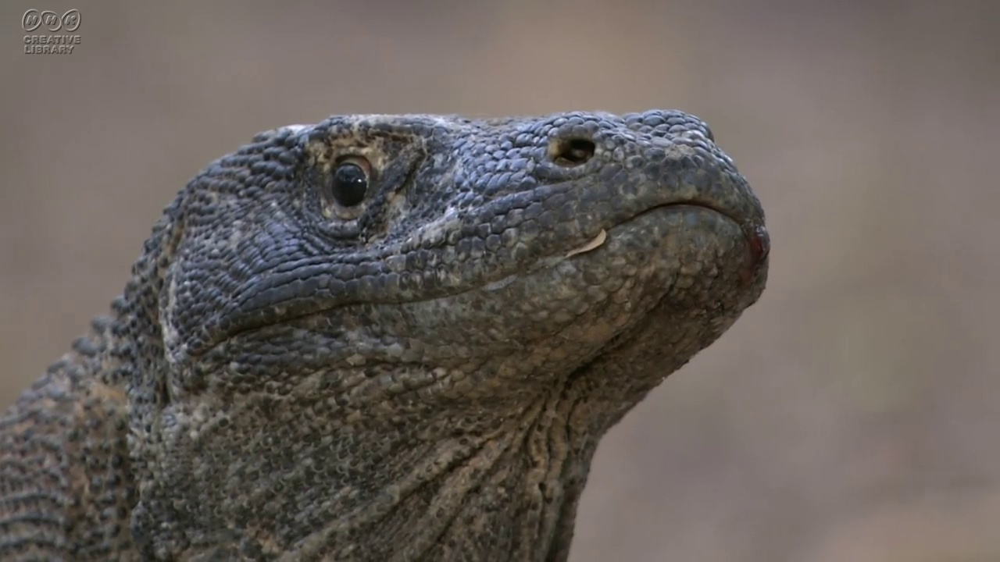

# mov2img
Make image file from movie file.  

# Requirement
Ubuntu 20.04  
OpenCV 4.5.2.

# Usage
動画ファイルを読み込んで、それを幾つかの画像に変換する。

# Features
Configクラス：読み込む動画、保存先パス、動画→画像変換の条件などを設定。  
save_all_frames関数：動画の全フレームを画像に変換する。※場合によっては、画像が大量に生成されるので使用前に注意。  
save_frame関数：1フレームだけ画像に変換する。  
save_frame_range関数：start, stop, stepのフレームを指定し、任意の範囲で任意の間隔で画像に変換する。  
save_frame_range_sec関数：start, stop, stepの時間[sec]を指定し、任意の範囲で任意の間隔で画像に変換する。  

# Reference
[参考にしたページ](https://note.nkmk.me/python-opencv-video-to-still-image/)  
[サンプル動画](http://www.ss-dc.com/tokusyu/tokusyu56.html)：  
NHKクリエイティブライブラリから動画を拝借。

# Author
暇人です。  
[Twitter](https://twitter.com/bunapeeeeeeee)

# Licence
MIT Licence
